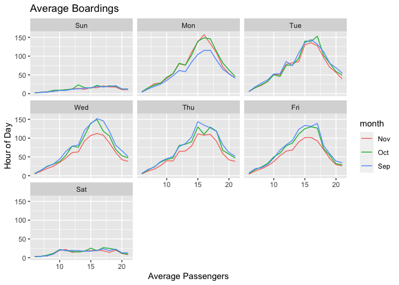
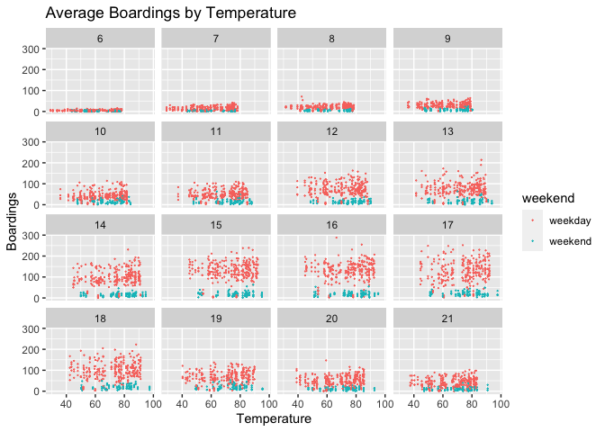
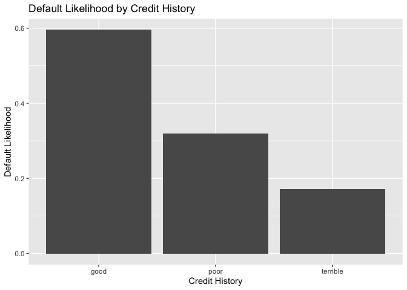
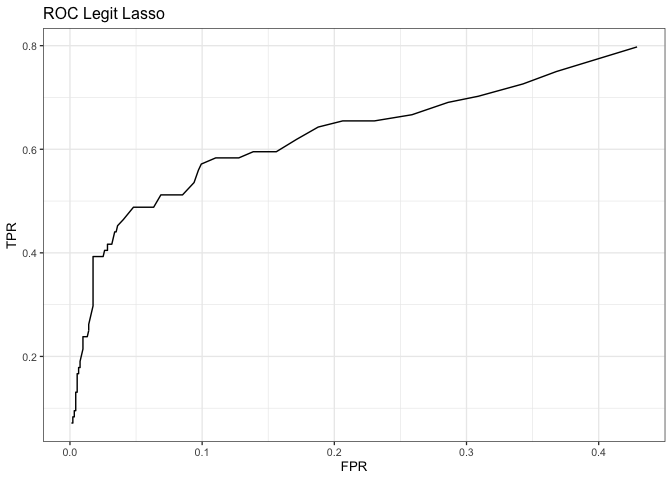

Note that the `echo = FALSE` parameter was added to the code chunk to
prevent printing of the R code that generated the plot.

\#1-a  Caption:
The plot above displays average boardings of Capital Metro buses on the
UT campus, averaged by hour of day, broken down by month (September,
October, November) and finally faceted by day of the week, and finally
by month (September, October, November). In general, the hour of peak
boardings fluctuates between 3PM and 5:30PM across weekdays.

This pattern is most likely the result of the majority of UT classes
ending in the afternoon between these hours. We note that on weekends,
there is no readily discernible peak boarding hour, since no classes are
held on weekends and there will be much fewer students on campus.
Average boardings on Mondays in September appear to be lower than in
other days and months. A possible reason for this is twofold. First,
given that the semester starts in late August and begins with syllabus
week, many students may choose to not go to campus an attend classes as
academic pressure is still low at this stage of the term. Second, having
just arrived at school, many students may be excited to see their peers
and spend their weekends partying (intensely) which may lower enthusiasm
for Monday classes.

Similarly, we observe that average boardings on Wednesday, Thursday, and
Friday appear lower in November. This is potentially caused by the fact
that in November most courses hold their midterms. Furthermore, the
majority of class assignments are likely due towards the end of the
week. This greater workload may compel some students to stay on campus
and study late into the night, causing them to miss the last bus and
return home using other means. \#1-b
 Caption: The
plot above shows boardings of Capital Metro buses in each 15-mimnute
window, by temperature, faceted by hour of day. Red and cyan points
correspond to data from weekdays and weekends, respectively.

Suppose we hold weekend status and the hour of the day constant and
examine all the data points for any one hour of the day. In this case,
temperature does not seem to have much of an effect on the number of
students riding the bus. While the number of boardings changes
considerably during the day, in any one-hour block, the cluster of data
points does not seem to exhibit any apparent trend with respect to
temperature.

\#2

    ## [1] 67639

    ## [1] 61049.9

    ## [1] 67118.25

The highest performing model is the step-wise selected linear model.
This is likely due to KNNs inability to handle many independent
variables, where the step wise function is able to systematically remove
low performing variables and keep high performing variables. Some
interactions might be adding variance without better explaining the
data, while others increase the models explanatory power. The KNN model
can’t get rid of the noise created by all the interactions while the
step-wise gradually eliminates variables till the model yielding the
lowest RMSE is produced. Having multiple favorable features in a
property like waterfront access and proximity to schools can increase
the value of a property exponentially, but the presence of some pairs of
features are much more significant than other pairs, so choosing a
method of modeling that can remove these non significant pairs (or
interactions) is crucial.

\#3  The bar plot
above displays the proportion of total of defaults for three credit
history classes, “good”, “poor”, and “terrible”. Intuitively, we would
expect that a worse credit history corresponds to a higher default rate.
Surprisingly, we observe the exact opposite of this relationship.
Borrowers with good credit history exhibit the highest default rate,
whereas those with terrible credit history exhibit the lowest default
rate of the three categories. This counterintuitive result likely stems
from how to dataset was constructed. As defaults are overall rather
rare, the German bank whose data we analyzed decided to sampled a set of
loans that had defaulted, and attempted to match this set with similar
loans that had not defaulted.

    ##   y yhat Frequency         Result
    ## 1 0    0     0.645  True Negative
    ## 2 1    0     0.185 False Negative
    ## 3 0    1     0.080 False Positive
    ## 4 1    1     0.090  True Positive

The set of loans that defaulted probably had a higher-than-average
proportion of loans with terrible credit history. Because this sample
had many more loans, it likely also had a broader set of characteristics
allowing matching with sample loans that did not default. The list of
loans with good credit history that defaulted, was much smaller, (as
individuals with good credit history do not often default on their
loans) and thus did was less likely to match with loans that did not
default. Hence by matching loans in such a way, the bank unintentionally
generated an inverse relationship between credit history and default
likelihood. The bank should thus change its sampling scheme. For
example, random sampling of loans would provide a better set of data, as
it would be a more accurate representation of the overall portfolio.

\#4-a

    ##    yhat
    ## y      0    1
    ##   0 8260    2
    ##   1  738    0

    ##    yhat_Logit
    ## y      0    1
    ##   0 8149  113
    ##   1  470  268

    ##    yhat_Lasso
    ## y      0    1
    ##   0 8170   71
    ##   1  547  212

\#Problem 4 Overview \#\# 4-a Rather than basic OLS, we used a Logit
regression for our baseline, as the probability bounding done by
Logistic Regression might offer better predictors of a binary likelihood
than OLS. However, the 1st linear model (children ~ market\_segment +
adults + customer\_type + is\_repeated\_guest) was so inaccurate we had
to lower our characterization threshold significantly in order to get it
to predict any nonzero number of children. The Big model performed
significantly better, and was a good baseline for our next steps. We
then performed a Lasso on all coefficients and interactions (after
transforming all categorical variables into 0/1 indicators for their
respective categories). The Lasso performed about as well as the Big
Model (which we attribute to the difference in distribution of
predictions between the LM produced by the Lasso and the one produced by
the Logit).

\#4-b

    ##    yhat_Lasso
    ## y     0   1
    ##   0 924   7
    ##   1  46  23

 \#\# 4-b
We then tested our Lasso linear model on the hotel\_val data set, and
found very similar error and confusion matrix to our hotel\_dev results.
The above ROC curve charts our True and False Positive Rates as we very
the classification threshold.

\#4-c

    ## [1] 0.3127181

Above is the mean True Positive Rate generated across all 20 folds of
our data, and a histogram of the TPRs across folds. Our results seem
relatively stable across folds. The mean RMSE is slightly higher than
our in-sample estimates, but that is to be expected with a validation
set.
