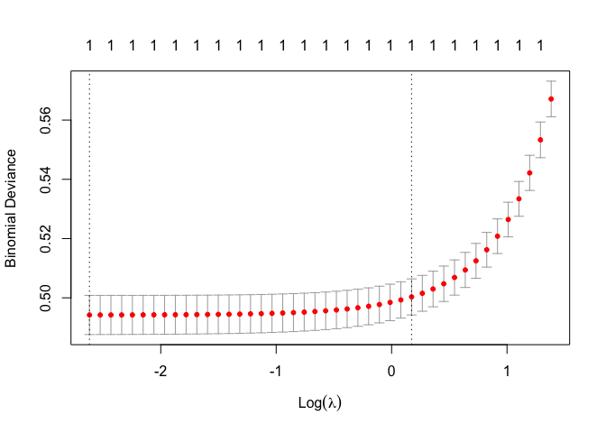

Note that the `echo = FALSE` parameter was added to the code chunk to
prevent printing of the R code that generated the plot.

\#1a 

\#1b 

\#Number 2

    ## [1] 72476.88

    ## [1] 70582.02

    ##        1        2        3        4        5 
    ## 65847.23 57196.18 62609.78 61927.48 69499.55

\#Number 3

    ##       X Default checkingstatus1 duration  history      purpose amount savings
    ## 5     5       1             A11       24     poor       newcar   4870     A61
    ## 7     7       0             A14       24     poor goods/repair   2835     A63
    ## 8     8       0             A12       36     poor      usedcar   6948     A61
    ## 9     9       0             A14       12     poor goods/repair   3059     A64
    ## 10   10       1             A12       30 terrible       newcar   5234     A61
    ## 16   16       1             A11       24     poor goods/repair   1282     A62
    ## 17   17       0             A14       24 terrible goods/repair   2424     A65
    ## 23   23       0             A11       10 terrible       newcar   2241     A61
    ## 24   24       0             A12       12 terrible      usedcar   1804     A62
    ## 29   29       0             A12        7     poor goods/repair   2415     A61
    ## 34   34       0             A14       12 terrible          biz   1264     A65
    ## 35   35       0             A13       12     poor goods/repair   1474     A61
    ## 40   40       0             A12        9     poor goods/repair    458     A61
    ## 43   43       0             A12       18     poor goods/repair   6204     A61
    ## 46   46       0             A14       11 terrible       newcar   1393     A61
    ## 47   47       0             A14       36     poor goods/repair   2299     A63
    ## 50   50       0             A14       12     poor goods/repair   2073     A62
    ## 51   51       0             A12       24     poor goods/repair   2333     A65
    ## 53   53       0             A14       12     poor goods/repair   1262     A61
    ## 58   58       0             A14       36 terrible goods/repair   9566     A61
    ## 59   59       0             A13       18     poor       newcar   1961     A61
    ## 60   60       1             A11       36 terrible goods/repair   6229     A61
    ## 67   67       0             A14       12     poor goods/repair   2171     A61
    ## 70   70       0             A14       36     poor goods/repair   2394     A65
    ## 71   71       0             A14       36     poor      usedcar   8133     A61
    ## 74   74       0             A12       42 terrible          biz   5954     A61
    ## 83   83       0             A14       18     poor          biz   1568     A62
    ## 92   92       0             A11       12 terrible      usedcar   1409     A61
    ## 93   93       1             A14       12 terrible goods/repair    797     A65
    ## 94   94       0             A13       24 terrible goods/repair   3617     A65
    ## 100 100       0             A12       20     poor      usedcar   7057     A65
    ## 102 102       0             A12       36     poor goods/repair   2323     A61
    ## 103 103       0             A14        6     poor goods/repair    932     A61
    ## 107 107       1             A14       18     good       newcar   6458     A61
    ## 112 112       0             A13       15     poor          edu    392     A61
    ## 117 117       1             A11       42     poor goods/repair   7174     A65
    ## 118 118       0             A11       10 terrible goods/repair   2132     A65
    ## 126 126       0             A11       12 terrible       newcar   2121     A61
    ## 128 128       1             A12       12     poor goods/repair    639     A61
    ## 129 129       0             A12       12 terrible      usedcar   1860     A61
    ## 138 138       1             A12       12     poor goods/repair    766     A63
    ## 142 142       0             A12       36     poor goods/repair   4795     A61
    ## 157 157       0             A11        9 terrible goods/repair   1288     A62
    ## 158 158       0             A11       12     good          edu    339     A61
    ## 162 162       0             A14       18 terrible       newcar   1055     A61
    ## 172 172       0             A14       12     poor goods/repair    763     A61
    ## 177 177       0             A11       12     poor goods/repair   2577     A61
    ## 179 179       0             A14       12     poor goods/repair   1963     A61
    ## 185 185       1             A12       18 terrible       newcar    884     A61
    ## 187 187       1             A12        9     good      usedcar   5129     A61
    ## 189 189       1             A11       12     poor goods/repair    674     A62
    ## 196 196       1             A12        9 terrible          edu   1501     A61
    ## 204 204       1             A11       12     poor          edu    902     A61
    ## 207 207       0             A14       12 terrible goods/repair   1935     A61
    ## 218 218       0             A13       36     poor goods/repair   3913     A61
    ## 228 228       1             A11       12     poor goods/repair   7865     A61
    ## 231 231       1             A13       36     poor goods/repair   4210     A61
    ## 234 234       0             A12       18     poor goods/repair    866     A61
    ## 240 240       0             A11       30     poor goods/repair   2522     A61
    ## 241 241       1             A11       24     poor       newcar    915     A65
    ## 248 248       0             A14        6     good       newcar   1204     A62
    ## 251 251       0             A11        6 terrible       newcar    666     A64
    ## 252 252       0             A13       12     poor goods/repair   2251     A61
    ## 268 268       0             A14       24     poor goods/repair   1533     A61
    ## 273 273       0             A12       48     good       newcar  12169     A65
    ## 277 277       0             A14       18 terrible goods/repair   2404     A61
    ## 281 281       0             A14       15 terrible      usedcar   3368     A64
    ## 282 282       0             A14       12     poor goods/repair   1574     A61
    ## 284 284       0             A14       15 terrible goods/repair   1520     A65
    ## 294 294       0             A13       42 terrible      usedcar   4796     A61
    ## 298 298       0             A14       10     poor       newcar   1287     A65
    ## 312 312       0             A14       24     poor goods/repair   5511     A62
    ## 313 313       0             A13       24     poor goods/repair   3749     A61
    ## 314 314       1             A12       12     poor       newcar    685     A61
    ## 318 318       0             A12       24     poor goods/repair   4351     A65
    ## 321 321       1             A12       30 terrible       newcar   4249     A61
    ## 328 328       0             A14       24     poor       newcar   1525     A64
    ## 329 329       0             A13       36     poor goods/repair   4473     A61
    ## 339 339       0             A11       24     poor goods/repair   4169     A61
    ## 342 342       0             A11       21     poor goods/repair   3599     A61
    ## 343 343       0             A12       18     poor goods/repair   3213     A63
    ## 345 345       0             A13       10     poor       newcar   3949     A61
    ## 361 361       0             A12       18     poor          edu   1239     A65
    ## 363 363       0             A13       12     poor       newcar   2247     A61
    ## 366 366       0             A14       12     poor          biz   1542     A61
    ## 370 370       0             A12       18     poor goods/repair   3001     A61
    ## 371 371       0             A14       36     poor       newcar   3079     A65
    ## 378 378       0             A14        7     poor goods/repair    846     A65
    ## 381 381       0             A11       20     poor goods/repair   2212     A65
    ## 389 389       0             A12       15 terrible          biz   2326     A63
    ## 391 391       0             A14       18     poor       newcar   1820     A61
    ## 398 398       0             A11       36 terrible goods/repair   2348     A61
    ## 418 418       0             A11       18     poor          edu   8471     A65
    ## 426 426       0             A12       18     poor      usedcar   2779     A61
    ## 430 430       1             A11       18 terrible goods/repair   1190     A61
    ## 435 435       0             A11        9     poor goods/repair   2136     A61
    ## 448 448       0             A12        7     poor goods/repair   2576     A61
    ## 454 454       0             A14       24     poor      usedcar   2670     A61
    ## 455 455       1             A11       24     poor       newcar   4817     A61
    ## 461 461       0             A11       36     poor goods/repair   3620     A61
    ## 470 470       0             A14       24     poor      usedcar   4679     A61
    ## 472 472       1             A11        6     poor          edu    448     A61
    ## 498 498       0             A14       24 terrible goods/repair   1585     A61
    ## 501 501       1             A11       24     poor       newcar   3123     A61
    ## 502 502       0             A11       36     poor      usedcar   5493     A61
    ## 503 503       0             A13        9     poor goods/repair   1126     A62
    ## 520 520       0             A14        6 terrible goods/repair    700     A65
    ## 525 525       0             A12       18     poor goods/repair   1113     A61
    ## 538 538       0             A12       18 terrible goods/repair   3612     A61
    ## 540 540       0             A13       18     poor goods/repair   3049     A61
    ## 554 554       0             A12       12 terrible       newcar   1995     A62
    ## 564 564       1             A12       36     poor       newcar  12389     A65
    ## 569 569       0             A12       48     poor goods/repair   3979     A65
    ## 571 571       1             A11       24     poor goods/repair   3234     A61
    ## 577 577       0             A12       12     poor goods/repair   2930     A61
    ## 579 579       1             A12       36 terrible       newcar   2820     A61
    ## 591 591       0             A11       12 terrible goods/repair    385     A61
    ## 592 592       0             A12       24     poor       newcar   1965     A65
    ## 594 594       1             A12       24     poor       newcar   2718     A61
    ## 603 603       1             A12       24     good          edu   1837     A61
    ## 606 606       0             A11       24     good goods/repair   2828     A63
    ## 615 615       1             A14       18     poor goods/repair   1808     A61
    ## 616 616       0             A12       48     good          biz  12204     A65
    ## 625 625       1             A11       18     poor goods/repair   2600     A61
    ## 626 626       0             A14       15     poor goods/repair   1979     A65
    ## 631 631       0             A11       24     poor goods/repair   3660     A61
    ## 632 632       1             A11       18     good goods/repair   1553     A61
    ## 634 634       1             A14        9     poor goods/repair   1980     A61
    ## 637 637       0             A14       24     poor goods/repair   1376     A63
    ## 639 639       0             A14       12     poor goods/repair   1493     A61
    ## 647 647       0             A11       30     good goods/repair   4583     A61
    ## 657 657       1             A12       12     poor       newcar    888     A61
    ## 659 659       0             A12       30     good          biz   4221     A61
    ## 662 662       1             A11       12     poor       newcar    900     A65
    ## 667 667       0             A12       30     good goods/repair   3496     A64
    ## 674 674       0             A14        6 terrible       newcar   2080     A63
    ## 679 679       0             A11       24     poor goods/repair   2384     A61
    ## 686 686       0             A14       60     poor       newcar   6527     A65
    ## 696 696       0             A14        6     poor      usedcar   1236     A63
    ## 697 697       0             A12       12     poor goods/repair   1103     A61
    ## 713 713       0             A14       21     poor      usedcar   2476     A65
    ## 718 718       0             A14       18     poor goods/repair   1505     A61
    ## 719 719       0             A13       24 terrible goods/repair   3148     A65
    ## 743 743       0             A14       21     poor goods/repair   3160     A65
    ## 749 749       0             A14       21     poor      usedcar   5248     A65
    ## 753 753       0             A12       12     poor          biz    841     A62
    ## 759 759       0             A14       24     poor       newcar   1393     A61
    ## 763 763       0             A11       12     poor goods/repair   2214     A61
    ## 768 768       0             A14       10     poor      usedcar   2901     A65
    ## 769 769       0             A12       12 terrible goods/repair   3617     A61
    ## 771 771       0             A11       24     poor      usedcar   2812     A65
    ## 777 777       0             A14       36 terrible       newcar   3535     A61
    ## 781 781       1             A12       39 terrible goods/repair   4933     A61
    ## 800 800       0             A12        9     poor       newcar   1549     A65
    ## 804 804       0             A14       12 terrible goods/repair    976     A65
    ## 806 806       1             A11       36     poor       newcar   9271     A61
    ## 807 807       0             A12        6     poor goods/repair    590     A61
    ## 809 809       0             A12       42     good      usedcar   9283     A61
    ## 812 812       0             A12        6     poor goods/repair    484     A61
    ## 818 818       0             A14        6 terrible goods/repair   1554     A61
    ## 821 821       0             A14       12     poor       newcar   1101     A61
    ## 823 823       1             A11       36     poor goods/repair   2712     A61
    ## 830 830       0             A12       48     poor          biz   6681     A65
    ## 831 831       0             A14       24     poor          biz   2375     A63
    ## 833 833       1             A11       45     good          biz  11816     A61
    ## 840 840       0             A14       24 terrible goods/repair   2611     A61
    ## 842 842       0             A14       21     poor      usedcar   2993     A61
    ## 856 856       0             A14       24     poor       newcar   1474     A62
    ## 860 860       0             A14        9     poor       newcar   3577     A62
    ## 861 861       0             A14       24 terrible      usedcar   5804     A64
    ## 863 863       1             A11       24     poor goods/repair   2439     A61
    ## 865 865       1             A14       10     poor goods/repair   2210     A61
    ## 876 876       0             A12       11 terrible       newcar   1322     A64
    ## 878 878       0             A14       36     poor goods/repair   3595     A61
    ## 884 884       0             A14       18 terrible goods/repair   1098     A61
    ## 893 893       0             A11       12 terrible       newcar   2171     A61
    ## 900 900       1             A11       18     poor goods/repair   4153     A61
    ## 902 902       0             A14       20 terrible       newcar   3485     A65
    ## 913 913       0             A12       30     poor goods/repair   2991     A65
    ## 917 917       0             A14       10     poor      usedcar   2848     A62
    ## 919 919       1             A11       24     poor goods/repair   2359     A62
    ## 920 920       1             A11       24     poor goods/repair   3345     A61
    ## 924 924       0             A12       12     poor       newcar   2002     A61
    ## 925 925       1             A11       24     good goods/repair   6872     A61
    ## 930 930       0             A11       12     poor       newcar   1344     A61
    ## 939 939       1             A12       60     poor          edu   6288     A61
    ## 952 952       1             A11       36     poor          biz   2145     A61
    ## 956 956       0             A11       24 terrible goods/repair   1231     A64
    ## 959 959       1             A11       28     poor       newcar   4006     A61
    ## 963 963       0             A14       15     poor       newcar   3556     A65
    ## 964 964       1             A14       24     poor goods/repair   2397     A63
    ## 965 965       0             A12        6     poor goods/repair    454     A61
    ## 968 968       0             A14       15     poor goods/repair   3568     A61
    ## 971 971       0             A12       15     poor goods/repair   1514     A62
    ## 972 972       0             A14       24     poor       newcar   7393     A61
    ## 980 980       1             A12       15     good       newcar   1264     A62
    ## 983 983       0             A13       21     poor       newcar   2923     A62
    ## 992 992       0             A14       15     good goods/repair   1569     A62
    ## 996 996       0             A14       12     poor goods/repair   1736     A61
    ## 999 999       1             A11       45     poor goods/repair   1845     A61
    ##     employ installment status others residence property age otherplans housing
    ## 5      A73           3    A93   A101         4     A124  53       A143    A153
    ## 7      A75           3    A93   A101         4     A122  53       A143    A152
    ## 8      A73           2    A93   A101         2     A123  35       A143    A151
    ## 9      A74           2    A91   A101         4     A121  61       A143    A152
    ## 10     A71           4    A94   A101         2     A123  28       A143    A152
    ## 16     A73           4    A92   A101         2     A123  32       A143    A152
    ## 17     A75           4    A93   A101         4     A122  53       A143    A152
    ## 23     A72           1    A93   A101         3     A121  48       A143    A151
    ## 24     A72           3    A93   A101         4     A122  44       A143    A152
    ## 29     A73           3    A93   A103         2     A121  34       A143    A152
    ## 34     A75           4    A93   A101         4     A124  57       A143    A151
    ## 35     A72           4    A92   A101         1     A122  33       A141    A152
    ## 40     A73           4    A93   A101         3     A121  24       A143    A152
    ## 43     A73           2    A93   A101         4     A121  44       A143    A152
    ## 46     A72           4    A92   A101         4     A123  35       A143    A152
    ## 47     A75           4    A93   A101         4     A123  39       A143    A152
    ## 50     A73           4    A92   A102         2     A121  28       A143    A152
    ## 51     A72           4    A93   A101         2     A122  29       A141    A152
    ## 53     A73           3    A93   A101         2     A123  25       A143    A152
    ## 58     A73           2    A92   A101         2     A123  31       A142    A152
    ## 59     A75           3    A92   A101         2     A123  23       A143    A152
    ## 60     A72           4    A92   A102         4     A124  23       A143    A151
    ## 67     A72           2    A92   A101         2     A123  29       A141    A152
    ## 70     A73           4    A92   A101         4     A123  25       A143    A152
    ## 71     A73           1    A92   A101         2     A122  30       A141    A152
    ## 74     A74           2    A92   A101         1     A121  41       A141    A152
    ## 83     A73           3    A92   A101         4     A122  24       A143    A151
    ## 92     A75           4    A93   A101         3     A121  54       A143    A152
    ## 93     A75           4    A92   A101         3     A122  33       A141    A152
    ## 94     A75           4    A93   A102         4     A124  20       A143    A151
    ## 100    A74           3    A93   A101         4     A122  36       A141    A151
    ## 102    A74           4    A93   A101         4     A123  24       A143    A151
    ## 103    A73           3    A92   A101         2     A121  24       A143    A152
    ## 107    A75           2    A93   A101         4     A124  39       A141    A152
    ## 112    A72           4    A92   A101         4     A122  23       A143    A151
    ## 117    A74           4    A92   A101         3     A123  30       A143    A152
    ## 118    A72           2    A92   A102         3     A121  27       A143    A151
    ## 126    A73           4    A93   A101         2     A122  30       A143    A152
    ## 128    A73           4    A93   A101         2     A123  30       A143    A152
    ## 129    A71           4    A93   A101         2     A123  34       A143    A152
    ## 138    A73           4    A93   A101         3     A121  66       A143    A152
    ## 142    A72           4    A92   A101         1     A124  30       A143    A152
    ## 157    A75           3    A93   A103         4     A121  48       A143    A152
    ## 158    A75           4    A94   A101         1     A123  45       A141    A152
    ## 162    A72           4    A92   A101         1     A122  30       A143    A152
    ## 172    A73           4    A92   A101         1     A121  26       A143    A152
    ## 177    A73           2    A91   A101         1     A123  42       A143    A152
    ## 179    A74           4    A93   A101         2     A123  31       A143    A151
    ## 185    A75           4    A93   A101         4     A123  36       A141    A152
    ## 187    A75           2    A92   A101         4     A124  74       A141    A153
    ## 189    A74           4    A94   A101         1     A122  20       A143    A152
    ## 196    A75           2    A92   A101         3     A123  34       A143    A152
    ## 204    A74           4    A94   A101         4     A122  21       A143    A151
    ## 207    A75           4    A93   A101         4     A121  43       A143    A152
    ## 218    A73           2    A93   A101         2     A121  23       A143    A152
    ## 228    A75           4    A93   A101         4     A124  53       A143    A153
    ## 231    A73           4    A93   A101         2     A123  26       A143    A152
    ## 234    A73           4    A94   A103         2     A121  25       A143    A152
    ## 240    A75           1    A93   A103         3     A122  39       A143    A152
    ## 241    A75           4    A92   A101         2     A123  29       A141    A152
    ## 248    A73           4    A93   A101         1     A124  35       A141    A151
    ## 251    A74           3    A92   A101         4     A121  39       A143    A152
    ## 252    A73           1    A92   A101         2     A123  46       A143    A152
    ## 268    A72           4    A92   A101         3     A123  38       A142    A152
    ## 273    A71           4    A93   A102         4     A124  36       A143    A153
    ## 277    A73           2    A92   A101         2     A123  26       A143    A152
    ## 281    A75           3    A93   A101         4     A124  23       A143    A151
    ## 282    A73           4    A93   A101         2     A121  50       A143    A152
    ## 284    A75           4    A93   A101         4     A122  63       A143    A152
    ## 294    A75           4    A93   A101         4     A124  56       A143    A153
    ## 298    A75           4    A93   A102         2     A122  45       A143    A152
    ## 312    A73           4    A93   A101         1     A123  25       A142    A152
    ## 313    A72           2    A92   A101         4     A123  26       A143    A152
    ## 314    A74           2    A94   A101         3     A123  25       A141    A152
    ## 318    A73           1    A92   A101         4     A122  48       A143    A152
    ## 321    A71           4    A94   A101         2     A123  28       A143    A152
    ## 328    A74           4    A92   A101         3     A123  34       A143    A152
    ## 329    A75           4    A93   A101         2     A123  31       A143    A152
    ## 339    A73           4    A93   A101         4     A122  28       A143    A152
    ## 342    A74           1    A92   A101         4     A123  26       A143    A151
    ## 343    A72           1    A94   A101         3     A121  25       A143    A151
    ## 345    A72           1    A93   A103         1     A122  37       A143    A152
    ## 361    A73           4    A93   A101         4     A124  61       A143    A153
    ## 363    A73           2    A92   A101         2     A123  36       A142    A152
    ## 366    A74           2    A93   A101         4     A123  36       A143    A152
    ## 370    A74           2    A92   A101         4     A121  40       A143    A151
    ## 371    A73           4    A93   A101         4     A121  36       A143    A152
    ## 378    A75           3    A93   A101         4     A124  36       A143    A153
    ## 381    A74           4    A93   A101         4     A123  39       A143    A152
    ## 389    A73           2    A93   A101         4     A123  27       A141    A152
    ## 391    A73           2    A94   A101         2     A122  30       A143    A152
    ## 398    A73           3    A94   A101         2     A122  46       A143    A152
    ## 418    A73           1    A92   A101         2     A123  23       A143    A151
    ## 426    A73           1    A94   A101         3     A123  21       A143    A151
    ## 430    A71           2    A92   A101         4     A124  55       A143    A153
    ## 435    A73           3    A93   A101         2     A121  25       A143    A152
    ## 448    A73           2    A93   A103         2     A121  35       A143    A152
    ## 454    A75           4    A93   A101         4     A123  35       A143    A152
    ## 455    A74           2    A93   A102         3     A122  31       A143    A152
    ## 461    A73           1    A93   A103         2     A122  37       A143    A152
    ## 470    A74           3    A93   A101         3     A123  35       A143    A152
    ## 472    A72           4    A92   A101         4     A122  23       A143    A152
    ## 498    A74           4    A93   A101         3     A122  40       A143    A152
    ## 501    A72           4    A92   A101         1     A122  27       A143    A152
    ## 502    A75           2    A93   A101         4     A124  42       A143    A153
    ## 503    A75           2    A91   A101         4     A121  49       A143    A152
    ## 520    A75           4    A93   A101         4     A124  36       A143    A153
    ## 525    A73           4    A92   A103         4     A121  26       A143    A152
    ## 538    A75           3    A92   A101         4     A122  37       A143    A152
    ## 540    A72           1    A92   A101         1     A122  45       A142    A152
    ## 554    A72           4    A93   A101         1     A123  27       A143    A152
    ## 564    A73           1    A93   A101         4     A124  37       A143    A153
    ## 569    A74           4    A93   A101         1     A123  41       A143    A152
    ## 571    A72           4    A92   A101         4     A121  23       A143    A151
    ## 577    A74           2    A92   A101         1     A121  27       A143    A152
    ## 579    A72           4    A91   A101         4     A123  27       A143    A152
    ## 591    A74           4    A92   A101         3     A121  58       A143    A152
    ## 592    A73           4    A92   A101         4     A123  42       A143    A151
    ## 594    A73           3    A92   A101         4     A122  20       A143    A151
    ## 603    A74           4    A92   A101         4     A124  34       A141    A153
    ## 606    A73           4    A93   A101         4     A121  22       A142    A152
    ## 615    A74           4    A92   A101         1     A121  22       A143    A152
    ## 616    A73           2    A93   A101         2     A123  48       A141    A152
    ## 625    A73           4    A93   A101         4     A124  65       A143    A153
    ## 626    A75           4    A93   A101         2     A123  35       A143    A152
    ## 631    A73           2    A92   A101         4     A123  28       A143    A152
    ## 632    A73           4    A93   A101         3     A123  44       A141    A152
    ## 634    A72           2    A92   A102         2     A123  19       A143    A151
    ## 637    A74           4    A92   A101         1     A123  28       A143    A152
    ## 639    A72           4    A92   A101         3     A123  34       A143    A152
    ## 647    A73           2    A91   A103         2     A121  32       A143    A152
    ## 657    A75           4    A93   A101         4     A123  41       A141    A152
    ## 659    A73           2    A92   A101         1     A123  28       A143    A152
    ## 662    A73           4    A94   A101         2     A123  23       A143    A152
    ## 667    A73           4    A93   A101         2     A123  34       A142    A152
    ## 674    A73           1    A94   A101         2     A123  24       A143    A152
    ## 679    A75           4    A93   A101         4     A121  64       A141    A151
    ## 686    A73           4    A93   A101         4     A124  34       A143    A153
    ## 696    A73           2    A93   A101         4     A122  50       A143    A151
    ## 697    A74           4    A93   A103         3     A121  29       A143    A152
    ## 713    A75           4    A93   A101         4     A121  46       A143    A152
    ## 718    A73           4    A93   A101         2     A124  32       A143    A153
    ## 719    A73           3    A93   A101         2     A123  31       A143    A152
    ## 743    A75           4    A93   A101         3     A122  41       A143    A152
    ## 749    A73           1    A93   A101         3     A123  26       A143    A152
    ## 753    A74           2    A92   A101         4     A121  23       A143    A151
    ## 759    A73           2    A93   A103         2     A121  31       A143    A152
    ## 763    A73           4    A93   A101         3     A122  24       A143    A152
    ## 768    A72           1    A92   A101         4     A121  31       A143    A151
    ## 769    A75           1    A93   A101         4     A123  28       A143    A151
    ## 771    A75           2    A92   A101         4     A121  26       A143    A151
    ## 777    A74           4    A93   A101         4     A123  37       A143    A152
    ## 781    A74           2    A93   A103         2     A121  25       A143    A152
    ## 800    A72           4    A93   A101         2     A121  35       A143    A152
    ## 804    A75           4    A93   A101         4     A123  35       A143    A152
    ## 806    A74           2    A93   A101         1     A123  24       A143    A152
    ## 807    A72           3    A94   A101         3     A121  26       A143    A152
    ## 809    A71           1    A93   A101         2     A124  55       A141    A153
    ## 812    A74           3    A94   A103         3     A121  28       A141    A152
    ## 818    A74           1    A92   A101         2     A123  24       A143    A151
    ## 821    A73           3    A94   A101         2     A121  27       A143    A152
    ## 823    A75           2    A93   A101         2     A122  41       A141    A152
    ## 830    A73           4    A93   A101         4     A124  38       A143    A153
    ## 831    A73           4    A93   A101         2     A123  44       A143    A152
    ## 833    A75           2    A93   A101         4     A123  29       A143    A151
    ## 840    A75           4    A94   A102         3     A121  46       A143    A152
    ## 842    A73           3    A93   A101         2     A121  28       A142    A152
    ## 856    A72           4    A94   A101         3     A121  33       A143    A152
    ## 860    A73           1    A93   A103         2     A121  26       A143    A151
    ## 861    A73           4    A93   A101         2     A121  27       A143    A152
    ## 863    A72           4    A92   A101         4     A121  35       A143    A152
    ## 865    A73           2    A93   A101         2     A121  25       A141    A151
    ## 876    A73           4    A92   A101         4     A123  40       A143    A152
    ## 878    A75           4    A93   A101         2     A123  28       A143    A152
    ## 884    A71           4    A92   A101         4     A123  65       A143    A152
    ## 893    A73           4    A93   A101         4     A122  38       A141    A152
    ## 900    A73           2    A93   A102         3     A123  42       A143    A152
    ## 902    A72           2    A91   A101         4     A121  44       A143    A152
    ## 913    A75           2    A92   A101         4     A123  25       A143    A152
    ## 917    A73           1    A93   A102         2     A121  32       A143    A152
    ## 919    A71           1    A91   A101         1     A122  33       A143    A152
    ## 920    A75           4    A93   A101         2     A122  39       A143    A151
    ## 924    A74           3    A93   A101         4     A122  30       A143    A151
    ## 925    A72           2    A91   A101         1     A122  55       A141    A152
    ## 930    A73           4    A93   A101         2     A121  43       A143    A152
    ## 939    A73           4    A93   A101         4     A124  42       A143    A153
    ## 952    A74           2    A93   A101         1     A123  24       A143    A152
    ## 956    A75           4    A92   A101         4     A122  57       A143    A151
    ## 959    A73           3    A93   A101         2     A123  45       A143    A152
    ## 963    A73           3    A93   A101         2     A124  29       A143    A152
    ## 964    A75           3    A93   A101         2     A123  35       A141    A152
    ## 965    A72           3    A94   A101         1     A122  22       A143    A152
    ## 968    A75           4    A92   A101         2     A123  54       A141    A151
    ## 971    A73           4    A93   A103         2     A121  22       A143    A152
    ## 972    A73           1    A93   A101         4     A122  43       A143    A152
    ## 980    A73           2    A94   A101         2     A122  25       A143    A151
    ## 983    A73           1    A92   A101         1     A123  28       A141    A152
    ## 992    A75           4    A93   A101         4     A123  34       A141    A152
    ## 996    A74           3    A92   A101         4     A121  31       A143    A152
    ## 999    A73           4    A93   A101         4     A124  23       A143    A153
    ##     cards  job liable tele foreign  rent Good Poor Terrible       yhat
    ## 5       2 A173      2 A191 foreign FALSE    0    1        0 0.44141663
    ## 7       1 A173      1 A191 foreign FALSE    0    1        0 0.22809387
    ## 8       1 A174      1 A192 foreign  TRUE    0    1        0 0.24832979
    ## 9       1 A172      1 A191 foreign FALSE    0    1        0 0.12448850
    ## 10      2 A174      1 A191 foreign FALSE    0    0        1 0.47541557
    ## 16      1 A172      1 A191 foreign FALSE    0    1        0 0.34267936
    ## 17      2 A173      1 A191 foreign FALSE    0    0        1 0.13116882
    ## 23      2 A172      2 A191  german  TRUE    0    0        1 0.04351427
    ## 24      1 A173      1 A191 foreign FALSE    0    0        1 0.04305326
    ## 29      1 A173      1 A191 foreign FALSE    0    1        0 0.21458284
    ## 34      1 A172      1 A191 foreign  TRUE    0    0        1 0.07620060
    ## 35      1 A174      1 A192 foreign FALSE    0    1        0 0.27140908
    ## 40      1 A173      1 A191 foreign FALSE    0    1        0 0.27621710
    ## 43      1 A172      2 A192 foreign FALSE    0    1        0 0.25038710
    ## 46      2 A174      1 A191 foreign FALSE    0    0        1 0.24024299
    ## 47      1 A173      1 A191 foreign FALSE    0    1        0 0.40584934
    ## 50      1 A173      1 A191 foreign FALSE    0    1        0 0.30653662
    ## 51      1 A172      1 A191 foreign FALSE    0    1        0 0.38169545
    ## 53      1 A173      1 A191 foreign FALSE    0    1        0 0.25630092
    ## 58      2 A173      1 A191 foreign FALSE    0    0        1 0.29895563
    ## 59      1 A174      1 A191 foreign FALSE    0    1        0 0.50040206
    ## 60      2 A172      1 A192 foreign  TRUE    0    0        1 0.37475189
    ## 67      1 A173      1 A191 foreign FALSE    0    1        0 0.21276510
    ## 70      1 A173      1 A191 foreign FALSE    0    1        0 0.48655774
    ## 71      1 A173      1 A191 foreign FALSE    0    1        0 0.24609951
    ## 74      2 A172      1 A191 foreign FALSE    0    0        1 0.20905039
    ## 83      1 A172      1 A191 foreign  TRUE    0    1        0 0.28541439
    ## 92      1 A173      1 A191 foreign FALSE    0    0        1 0.04199894
    ## 93      1 A172      2 A191 foreign FALSE    0    0        1 0.12742921
    ## 94      2 A173      1 A191 foreign  TRUE    0    0        1 0.26385127
    ## 100     2 A174      2 A192 foreign  TRUE    0    1        0 0.21033853
    ## 102     1 A173      1 A191 foreign  TRUE    0    1        0 0.49053604
    ## 103     1 A173      1 A191 foreign FALSE    0    1        0 0.22441765
    ## 107     2 A174      2 A192 foreign FALSE    1    0        0 0.73925576
    ## 112     1 A173      1 A192 foreign  TRUE    0    1        0 0.43213358
    ## 117     1 A174      1 A192 foreign FALSE    0    1        0 0.61230020
    ## 118     2 A173      1 A191  german  TRUE    0    0        1 0.04021755
    ## 126     2 A173      1 A191 foreign FALSE    0    0        1 0.28086006
    ## 128     1 A173      1 A191 foreign FALSE    0    1        0 0.26906176
    ## 129     2 A174      1 A192 foreign FALSE    0    0        1 0.06727701
    ## 138     1 A172      1 A191 foreign FALSE    0    1        0 0.14117355
    ## 142     1 A174      1 A192 foreign FALSE    0    1        0 0.51571481
    ## 157     2 A173      2 A191  german FALSE    0    0        1 0.02877427
    ## 158     1 A172      1 A191 foreign FALSE    1    0        0 0.58682311
    ## 162     2 A173      1 A191 foreign FALSE    0    0        1 0.29389066
    ## 172     1 A173      1 A192 foreign FALSE    0    1        0 0.28975739
    ## 177     1 A173      1 A191 foreign FALSE    0    1        0 0.17294264
    ## 179     2 A174      2 A192 foreign  TRUE    0    1        0 0.29005622
    ## 185     1 A173      2 A192 foreign FALSE    0    0        1 0.26320793
    ## 187     1 A174      2 A192 foreign FALSE    1    0        0 0.15407479
    ## 189     1 A173      1 A191 foreign FALSE    0    1        0 0.31675931
    ## 196     2 A174      1 A192 foreign FALSE    0    0        1 0.12643869
    ## 204     1 A173      1 A191 foreign  TRUE    0    1        0 0.43494308
    ## 207     3 A173      1 A192 foreign FALSE    0    0        1 0.11485901
    ## 218     1 A173      1 A192 foreign FALSE    0    1        0 0.41550673
    ## 228     1 A174      1 A192 foreign FALSE    0    1        0 0.30384467
    ## 231     1 A173      1 A191 foreign FALSE    0    1        0 0.52440357
    ## 234     1 A172      1 A191 foreign FALSE    0    1        0 0.33224419
    ## 240     1 A173      2 A191 foreign FALSE    0    1        0 0.22380585
    ## 241     1 A173      1 A191 foreign FALSE    0    1        0 0.54242059
    ## 248     1 A173      1 A191  german  TRUE    1    0        0 0.44938391
    ## 251     2 A172      1 A192 foreign FALSE    0    0        1 0.15582999
    ## 252     1 A172      1 A191 foreign FALSE    0    1        0 0.12714519
    ## 268     1 A173      1 A192 foreign FALSE    0    1        0 0.31784481
    ## 273     1 A174      1 A192 foreign FALSE    1    0        0 0.95102735
    ## 277     2 A173      1 A191 foreign FALSE    0    0        1 0.12748894
    ## 281     2 A173      1 A192 foreign  TRUE    0    0        1 0.08386578
    ## 282     1 A173      1 A191 foreign FALSE    0    1        0 0.20353492
    ## 284     1 A173      1 A191 foreign FALSE    0    0        1 0.07917901
    ## 294     1 A173      1 A191 foreign FALSE    0    0        1 0.11729762
    ## 298     1 A172      1 A191  german FALSE    0    1        0 0.17886245
    ## 312     1 A173      1 A191 foreign FALSE    0    1        0 0.47837186
    ## 313     1 A173      1 A191 foreign FALSE    0    1        0 0.31930434
    ## 314     1 A172      1 A191 foreign FALSE    0    1        0 0.36089504
    ## 318     1 A172      1 A192 foreign FALSE    0    1        0 0.19175290
    ## 321     2 A174      1 A191 foreign FALSE    0    0        1 0.45192230
    ## 328     1 A173      2 A192 foreign FALSE    0    1        0 0.52870465
    ## 329     1 A173      1 A191 foreign FALSE    0    1        0 0.50231458
    ## 339     1 A173      1 A191 foreign FALSE    0    1        0 0.42959579
    ## 342     1 A172      1 A191 foreign  TRUE    0    1        0 0.25093514
    ## 343     1 A173      1 A191 foreign  TRUE    0    1        0 0.23310238
    ## 345     1 A172      2 A191 foreign FALSE    0    1        0 0.30453755
    ## 361     1 A173      1 A191 foreign FALSE    0    1        0 0.27432510
    ## 363     2 A173      1 A192 foreign FALSE    0    1        0 0.33811650
    ## 366     1 A173      1 A192 foreign FALSE    0    1        0 0.16822423
    ## 370     1 A173      1 A191 foreign  TRUE    0    1        0 0.21200563
    ## 371     1 A173      1 A191 foreign FALSE    0    1        0 0.63421615
    ## 378     1 A173      1 A191 foreign FALSE    0    1        0 0.18339754
    ## 381     1 A173      1 A192 foreign FALSE    0    1        0 0.30324579
    ## 389     1 A173      1 A191 foreign FALSE    0    0        1 0.10842127
    ## 391     1 A174      1 A192 foreign FALSE    0    1        0 0.39882385
    ## 398     2 A173      1 A192 foreign FALSE    0    0        1 0.16160222
    ## 418     2 A173      1 A192 foreign  TRUE    0    1        0 0.46675835
    ## 426     1 A173      1 A192 foreign  TRUE    0    1        0 0.12716902
    ## 430     3 A171      2 A191 foreign FALSE    0    0        1 0.06302961
    ## 435     1 A173      1 A191 foreign FALSE    0    1        0 0.25647118
    ## 448     1 A173      1 A191 foreign FALSE    0    1        0 0.17593574
    ## 454     1 A174      1 A192 foreign FALSE    0    1        0 0.20244673
    ## 455     1 A173      1 A192 foreign FALSE    0    1        0 0.50507348
    ## 461     1 A173      2 A191 foreign FALSE    0    1        0 0.28354759
    ## 470     2 A172      1 A192 foreign FALSE    0    1        0 0.19502652
    ## 472     1 A173      1 A191 foreign FALSE    0    1        0 0.37364173
    ## 498     2 A173      1 A191 foreign FALSE    0    0        1 0.15767570
    ## 501     1 A173      1 A191 foreign FALSE    0    1        0 0.60524472
    ## 502     1 A173      2 A191 foreign FALSE    0    1        0 0.19682714
    ## 503     1 A173      1 A191 foreign FALSE    0    1        0 0.12497016
    ## 520     2 A173      1 A191 foreign FALSE    0    0        1 0.10272723
    ## 525     1 A172      2 A191 foreign FALSE    0    1        0 0.33245762
    ## 538     1 A173      1 A192 foreign FALSE    0    0        1 0.13965008
    ## 540     1 A172      1 A191 foreign FALSE    0    1        0 0.15959308
    ## 554     1 A173      1 A191 foreign FALSE    0    0        1 0.29233119
    ## 564     1 A173      1 A192 foreign FALSE    0    1        0 0.66879559
    ## 569     2 A173      2 A192 foreign FALSE    0    1        0 0.51657851
    ## 571     1 A172      1 A192 foreign  TRUE    0    1        0 0.43547899
    ## 577     1 A173      1 A191 foreign FALSE    0    1        0 0.23324767
    ## 579     2 A173      1 A191 foreign FALSE    0    0        1 0.46471893
    ## 591     4 A172      1 A192 foreign FALSE    0    0        1 0.07366425
    ## 592     2 A173      1 A192 foreign  TRUE    0    1        0 0.49382361
    ## 594     1 A172      1 A192 foreign  TRUE    0    1        0 0.57647538
    ## 603     1 A172      1 A191 foreign FALSE    1    0        0 0.74581231
    ## 606     1 A173      1 A192 foreign FALSE    1    0        0 0.71837239
    ## 615     1 A173      1 A191 foreign FALSE    0    1        0 0.36830626
    ## 616     1 A174      1 A192 foreign FALSE    1    0        0 0.79564042
    ## 625     2 A173      1 A191 foreign FALSE    0    1        0 0.19138836
    ## 626     1 A173      1 A191 foreign FALSE    0    1        0 0.28873047
    ## 631     1 A173      1 A191 foreign FALSE    0    1        0 0.30768311
    ## 632     1 A173      1 A191 foreign FALSE    1    0        0 0.53695254
    ## 634     2 A173      1 A191 foreign  TRUE    0    1        0 0.23464189
    ## 637     1 A173      1 A191 foreign FALSE    0    1        0 0.36553288
    ## 639     1 A173      2 A191 foreign FALSE    0    1        0 0.26729404
    ## 647     2 A173      1 A191 foreign FALSE    1    0        0 0.63753555
    ## 657     1 A172      2 A191 foreign FALSE    0    1        0 0.39243610
    ## 659     2 A173      1 A191 foreign FALSE    1    0        0 0.63423476
    ## 662     1 A173      1 A191 foreign FALSE    0    1        0 0.49331375
    ## 667     1 A173      2 A192 foreign FALSE    1    0        0 0.70963031
    ## 674     1 A173      1 A191 foreign FALSE    0    0        1 0.15556526
    ## 679     1 A172      1 A191 foreign  TRUE    0    1        0 0.21872619
    ## 686     1 A173      2 A192 foreign FALSE    0    1        0 0.83063901
    ## 696     1 A173      1 A191 foreign  TRUE    0    1        0 0.05593745
    ## 697     2 A173      1 A191  german FALSE    0    1        0 0.12884826
    ## 713     1 A174      1 A192 foreign FALSE    0    1        0 0.15152517
    ## 718     1 A174      1 A192 foreign FALSE    0    1        0 0.31090714
    ## 719     2 A173      1 A192 foreign FALSE    0    0        1 0.17358670
    ## 743     1 A173      1 A192 foreign FALSE    0    1        0 0.31891462
    ## 749     1 A173      1 A191 foreign FALSE    0    1        0 0.15185942
    ## 753     1 A172      1 A191 foreign  TRUE    0    1        0 0.20262179
    ## 759     1 A173      1 A192 foreign FALSE    0    1        0 0.42356268
    ## 763     1 A172      1 A191 foreign FALSE    0    1        0 0.32917803
    ## 768     1 A173      1 A191 foreign  TRUE    0    1        0 0.08603460
    ## 769     3 A173      1 A192 foreign  TRUE    0    0        1 0.09469000
    ## 771     1 A173      1 A191 foreign  TRUE    0    1        0 0.16362468
    ## 777     2 A173      1 A192 foreign FALSE    0    0        1 0.42553409
    ## 781     2 A173      1 A191 foreign FALSE    0    0        1 0.25400411
    ## 800     1 A171      1 A191 foreign FALSE    0    1        0 0.42062017
    ## 804     2 A173      1 A191 foreign FALSE    0    0        1 0.12431621
    ## 806     1 A173      1 A192 foreign FALSE    0    1        0 0.71879312
    ## 807     1 A172      1 A191  german FALSE    0    1        0 0.09133734
    ## 809     1 A174      1 A192 foreign FALSE    1    0        0 0.45029592
    ## 812     1 A172      1 A191 foreign FALSE    0    1        0 0.20197249
    ## 818     2 A173      1 A192 foreign  TRUE    0    0        1 0.07374497
    ## 821     2 A173      1 A192 foreign FALSE    0    1        0 0.41636398
    ## 823     1 A173      2 A191 foreign FALSE    0    1        0 0.29616178
    ## 830     1 A173      2 A192 foreign FALSE    0    1        0 0.58012220
    ## 831     2 A173      2 A192 foreign FALSE    0    1        0 0.29115574
    ## 833     2 A173      1 A191 foreign  TRUE    1    0        0 0.84171121
    ## 840     2 A173      1 A191 foreign FALSE    0    0        1 0.15269773
    ## 842     2 A172      1 A191 foreign FALSE    0    1        0 0.18194424
    ## 856     1 A173      1 A192 foreign FALSE    0    1        0 0.53314761
    ## 860     1 A173      2 A191  german  TRUE    0    1        0 0.16546766
    ## 861     2 A173      1 A191 foreign FALSE    0    0        1 0.14678722
    ## 863     1 A173      1 A192 foreign FALSE    0    1        0 0.35238206
    ## 865     1 A172      1 A191 foreign  TRUE    0    1        0 0.21943438
    ## 876     2 A173      1 A191 foreign FALSE    0    0        1 0.21894561
    ## 878     1 A173      1 A191 foreign FALSE    0    1        0 0.49830768
    ## 884     2 A171      1 A191 foreign FALSE    0    0        1 0.07896067
    ## 893     2 A172      1 A191  german FALSE    0    0        1 0.10945700
    ## 900     1 A173      1 A191 foreign FALSE    0    1        0 0.22307542
    ## 902     2 A173      1 A192 foreign FALSE    0    0        1 0.20019797
    ## 913     1 A173      1 A191 foreign FALSE    0    1        0 0.34500812
    ## 917     1 A173      2 A191 foreign FALSE    0    1        0 0.08387233
    ## 919     1 A173      1 A191 foreign FALSE    0    1        0 0.21606244
    ## 920     1 A174      1 A192 foreign  TRUE    0    1        0 0.35146547
    ## 924     1 A173      2 A192 foreign  TRUE    0    1        0 0.42080159
    ## 925     1 A173      1 A192 foreign FALSE    1    0        0 0.52386150
    ## 930     2 A172      2 A191 foreign FALSE    0    1        0 0.39202568
    ## 939     1 A173      1 A191 foreign FALSE    0    1        0 0.75114977
    ## 952     2 A173      1 A192 foreign FALSE    0    1        0 0.35341971
    ## 956     2 A174      1 A192 foreign  TRUE    0    0        1 0.10948262
    ## 959     1 A172      1 A191 foreign FALSE    0    1        0 0.49354072
    ## 963     1 A173      1 A191 foreign FALSE    0    1        0 0.48382329
    ## 964     2 A173      1 A192 foreign FALSE    0    1        0 0.29902678
    ## 965     1 A172      1 A191 foreign FALSE    0    1        0 0.22434999
    ## 968     1 A174      1 A192 foreign  TRUE    0    1        0 0.23486424
    ## 971     1 A173      1 A191 foreign FALSE    0    1        0 0.34284500
    ## 972     1 A172      2 A191 foreign FALSE    0    1        0 0.43912687
    ## 980     1 A173      1 A191 foreign  TRUE    1    0        0 0.68549854
    ## 983     1 A174      1 A192 foreign FALSE    0    1        0 0.39760178
    ## 992     1 A172      2 A191 foreign FALSE    1    0        0 0.57297315
    ## 996     1 A172      1 A191 foreign FALSE    0    1        0 0.23935674
    ## 999     1 A173      1 A192 foreign FALSE    0    1        0 0.54682834

    ##    yhat
    ## y     0   1
    ##   0 133  17
    ##   1  34  16

    ##    yhat
    ## y      0    1
    ##   0 8273    1
    ##   1  726    0

    ## Warning: glm.fit: fitted probabilities numerically 0 or 1 occurred

    ##    yhat
    ## y      0    1
    ##   0 8178   96
    ##   1  478  248

    ## fold 1,2,3,4,5,6,7,8,9,10,done.

\#lasso testing

    ## Warning: package 'glmnet' was built under R version 4.1.1

    ## Loaded glmnet 4.1-3

    ## Training
    ##   |                                                                              |                                                                      |   0%  |                                                                              |=                                                                     |   1%  |                                                                              |=                                                                     |   2%  |                                                                              |==                                                                    |   3%  |                                                                              |===                                                                   |   4%  |                                                                              |====                                                                  |   5%  |                                                                              |====                                                                  |   6%  |                                                                              |=====                                                                 |   7%  |                                                                              |======                                                                |   8%  |                                                                              |======                                                                |   9%  |                                                                              |=======                                                               |  10%  |                                                                              |========                                                              |  11%  |                                                                              |========                                                              |  12%  |                                                                              |=========                                                             |  13%  |                                                                              |==========                                                            |  14%  |                                                                              |==========                                                            |  15%  |                                                                              |===========                                                           |  16%  |                                                                              |============                                                          |  17%  |                                                                              |=============                                                         |  18%  |                                                                              |=============                                                         |  19%  |                                                                              |==============                                                        |  20%  |                                                                              |===============                                                       |  21%  |                                                                              |===============                                                       |  22%  |                                                                              |================                                                      |  23%  |                                                                              |=================                                                     |  24%  |                                                                              |==================                                                    |  25%  |                                                                              |==================                                                    |  26%  |                                                                              |===================                                                   |  27%  |                                                                              |====================                                                  |  28%  |                                                                              |====================                                                  |  29%  |                                                                              |=====================                                                 |  30%  |                                                                              |======================                                                |  31%  |                                                                              |======================                                                |  32%  |                                                                              |=======================                                               |  33%  |                                                                              |========================                                              |  34%  |                                                                              |========================                                              |  35%  |                                                                              |=========================                                             |  36%  |                                                                              |==========================                                            |  37%  |                                                                              |===========================                                           |  38%  |                                                                              |===========================                                           |  39%  |                                                                              |============================                                          |  40%  |                                                                              |=============================                                         |  41%  |                                                                              |=============================                                         |  42%  |                                                                              |==============================                                        |  43%  |                                                                              |===============================                                       |  44%  |                                                                              |======================================================================| 100%
    ## Fold: 1/10
    ##   |                                                                              |                                                                      |   0%  |                                                                              |=                                                                     |   1%  |                                                                              |=                                                                     |   2%  |                                                                              |==                                                                    |   3%  |                                                                              |===                                                                   |   4%  |                                                                              |====                                                                  |   5%  |                                                                              |====                                                                  |   6%  |                                                                              |=====                                                                 |   7%  |                                                                              |======                                                                |   8%  |                                                                              |======                                                                |   9%  |                                                                              |=======                                                               |  10%  |                                                                              |========                                                              |  11%  |                                                                              |========                                                              |  12%  |                                                                              |=========                                                             |  13%  |                                                                              |==========                                                            |  14%  |                                                                              |==========                                                            |  15%  |                                                                              |===========                                                           |  16%  |                                                                              |============                                                          |  17%  |                                                                              |=============                                                         |  18%  |                                                                              |=============                                                         |  19%  |                                                                              |==============                                                        |  20%  |                                                                              |===============                                                       |  21%  |                                                                              |===============                                                       |  22%  |                                                                              |================                                                      |  23%  |                                                                              |=================                                                     |  24%  |                                                                              |==================                                                    |  25%  |                                                                              |==================                                                    |  26%  |                                                                              |===================                                                   |  27%  |                                                                              |====================                                                  |  28%  |                                                                              |====================                                                  |  29%  |                                                                              |=====================                                                 |  30%  |                                                                              |======================                                                |  31%  |                                                                              |======================                                                |  32%  |                                                                              |=======================                                               |  33%  |                                                                              |========================                                              |  34%  |                                                                              |========================                                              |  35%  |                                                                              |=========================                                             |  36%  |                                                                              |==========================                                            |  37%  |                                                                              |===========================                                           |  38%  |                                                                              |===========================                                           |  39%  |                                                                              |============================                                          |  40%  |                                                                              |=============================                                         |  41%  |                                                                              |=============================                                         |  42%  |                                                                              |==============================                                        |  43%  |                                                                              |===============================                                       |  44%  |                                                                              |======================================================================| 100%
    ## Fold: 2/10
    ##   |                                                                              |                                                                      |   0%  |                                                                              |=                                                                     |   1%  |                                                                              |=                                                                     |   2%  |                                                                              |==                                                                    |   3%  |                                                                              |===                                                                   |   4%  |                                                                              |====                                                                  |   5%  |                                                                              |====                                                                  |   6%  |                                                                              |=====                                                                 |   7%  |                                                                              |======                                                                |   8%  |                                                                              |======                                                                |   9%  |                                                                              |=======                                                               |  10%  |                                                                              |========                                                              |  11%  |                                                                              |========                                                              |  12%  |                                                                              |=========                                                             |  13%  |                                                                              |==========                                                            |  14%  |                                                                              |==========                                                            |  15%  |                                                                              |===========                                                           |  16%  |                                                                              |============                                                          |  17%  |                                                                              |=============                                                         |  18%  |                                                                              |=============                                                         |  19%  |                                                                              |==============                                                        |  20%  |                                                                              |===============                                                       |  21%  |                                                                              |===============                                                       |  22%  |                                                                              |================                                                      |  23%  |                                                                              |=================                                                     |  24%  |                                                                              |==================                                                    |  25%  |                                                                              |==================                                                    |  26%  |                                                                              |===================                                                   |  27%  |                                                                              |====================                                                  |  28%  |                                                                              |====================                                                  |  29%  |                                                                              |=====================                                                 |  30%  |                                                                              |======================                                                |  31%  |                                                                              |======================                                                |  32%  |                                                                              |=======================                                               |  33%  |                                                                              |========================                                              |  34%  |                                                                              |========================                                              |  35%  |                                                                              |=========================                                             |  36%  |                                                                              |==========================                                            |  37%  |                                                                              |===========================                                           |  38%  |                                                                              |===========================                                           |  39%  |                                                                              |============================                                          |  40%  |                                                                              |=============================                                         |  41%  |                                                                              |=============================                                         |  42%  |                                                                              |==============================                                        |  43%  |                                                                              |===============================                                       |  44%  |                                                                              |======================================================================| 100%
    ## Fold: 3/10
    ##   |                                                                              |                                                                      |   0%  |                                                                              |=                                                                     |   1%  |                                                                              |=                                                                     |   2%  |                                                                              |==                                                                    |   3%  |                                                                              |===                                                                   |   4%  |                                                                              |====                                                                  |   5%  |                                                                              |====                                                                  |   6%  |                                                                              |=====                                                                 |   7%  |                                                                              |======                                                                |   8%  |                                                                              |======                                                                |   9%  |                                                                              |=======                                                               |  10%  |                                                                              |========                                                              |  11%  |                                                                              |========                                                              |  12%  |                                                                              |=========                                                             |  13%  |                                                                              |==========                                                            |  14%  |                                                                              |==========                                                            |  15%  |                                                                              |===========                                                           |  16%  |                                                                              |============                                                          |  17%  |                                                                              |=============                                                         |  18%  |                                                                              |=============                                                         |  19%  |                                                                              |==============                                                        |  20%  |                                                                              |===============                                                       |  21%  |                                                                              |===============                                                       |  22%  |                                                                              |================                                                      |  23%  |                                                                              |=================                                                     |  24%  |                                                                              |==================                                                    |  25%  |                                                                              |==================                                                    |  26%  |                                                                              |===================                                                   |  27%  |                                                                              |====================                                                  |  28%  |                                                                              |====================                                                  |  29%  |                                                                              |=====================                                                 |  30%  |                                                                              |======================                                                |  31%  |                                                                              |======================                                                |  32%  |                                                                              |=======================                                               |  33%  |                                                                              |========================                                              |  34%  |                                                                              |========================                                              |  35%  |                                                                              |=========================                                             |  36%  |                                                                              |==========================                                            |  37%  |                                                                              |===========================                                           |  38%  |                                                                              |===========================                                           |  39%  |                                                                              |============================                                          |  40%  |                                                                              |=============================                                         |  41%  |                                                                              |=============================                                         |  42%  |                                                                              |==============================                                        |  43%  |                                                                              |===============================                                       |  44%  |                                                                              |======================================================================| 100%
    ## Fold: 4/10
    ##   |                                                                              |                                                                      |   0%  |                                                                              |=                                                                     |   1%  |                                                                              |=                                                                     |   2%  |                                                                              |==                                                                    |   3%  |                                                                              |===                                                                   |   4%  |                                                                              |====                                                                  |   5%  |                                                                              |====                                                                  |   6%  |                                                                              |=====                                                                 |   7%  |                                                                              |======                                                                |   8%  |                                                                              |======                                                                |   9%  |                                                                              |=======                                                               |  10%  |                                                                              |========                                                              |  11%  |                                                                              |========                                                              |  12%  |                                                                              |=========                                                             |  13%  |                                                                              |==========                                                            |  14%  |                                                                              |==========                                                            |  15%  |                                                                              |===========                                                           |  16%  |                                                                              |============                                                          |  17%  |                                                                              |=============                                                         |  18%  |                                                                              |=============                                                         |  19%  |                                                                              |==============                                                        |  20%  |                                                                              |===============                                                       |  21%  |                                                                              |===============                                                       |  22%  |                                                                              |================                                                      |  23%  |                                                                              |=================                                                     |  24%  |                                                                              |==================                                                    |  25%  |                                                                              |==================                                                    |  26%  |                                                                              |===================                                                   |  27%  |                                                                              |====================                                                  |  28%  |                                                                              |====================                                                  |  29%  |                                                                              |=====================                                                 |  30%  |                                                                              |======================                                                |  31%  |                                                                              |======================                                                |  32%  |                                                                              |=======================                                               |  33%  |                                                                              |========================                                              |  34%  |                                                                              |========================                                              |  35%  |                                                                              |=========================                                             |  36%  |                                                                              |==========================                                            |  37%  |                                                                              |===========================                                           |  38%  |                                                                              |===========================                                           |  39%  |                                                                              |============================                                          |  40%  |                                                                              |=============================                                         |  41%  |                                                                              |=============================                                         |  42%  |                                                                              |==============================                                        |  43%  |                                                                              |===============================                                       |  44%  |                                                                              |================================                                      |  45%  |                                                                              |================================                                      |  46%  |                                                                              |=================================                                     |  47%  |                                                                              |==================================                                    |  48%  |                                                                              |==================================                                    |  49%  |                                                                              |===================================                                   |  50%  |                                                                              |====================================                                  |  51%  |                                                                              |====================================                                  |  52%  |                                                                              |=====================================                                 |  53%  |                                                                              |======================================                                |  54%  |                                                                              |======================================                                |  55%  |                                                                              |=======================================                               |  56%  |                                                                              |========================================                              |  57%  |                                                                              |=========================================                             |  58%  |                                                                              |=========================================                             |  59%  |                                                                              |==========================================                            |  60%  |                                                                              |===========================================                           |  61%  |                                                                              |===========================================                           |  62%  |                                                                              |============================================                          |  63%  |                                                                              |=============================================                         |  64%  |                                                                              |==============================================                        |  65%  |                                                                              |==============================================                        |  66%  |                                                                              |===============================================                       |  67%  |                                                                              |================================================                      |  68%  |                                                                              |================================================                      |  69%  |                                                                              |=================================================                     |  70%  |                                                                              |==================================================                    |  71%  |                                                                              |==================================================                    |  72%  |                                                                              |===================================================                   |  73%  |                                                                              |====================================================                  |  74%  |                                                                              |====================================================                  |  75%  |                                                                              |=====================================================                 |  76%  |                                                                              |======================================================                |  77%  |                                                                              |=======================================================               |  78%  |                                                                              |=======================================================               |  79%  |                                                                              |========================================================              |  80%  |                                                                              |=========================================================             |  81%  |                                                                              |=========================================================             |  82%  |                                                                              |==========================================================            |  83%  |                                                                              |===========================================================           |  84%  |                                                                              |============================================================          |  85%  |                                                                              |============================================================          |  86%  |                                                                              |=============================================================         |  87%  |                                                                              |==============================================================        |  88%  |                                                                              |==============================================================        |  89%  |                                                                              |===============================================================       |  90%  |                                                                              |================================================================      |  91%  |                                                                              |================================================================      |  92%  |                                                                              |=================================================================     |  93%  |                                                                              |==================================================================    |  94%  |                                                                              |==================================================================    |  95%  |                                                                              |===================================================================   |  96%  |                                                                              |====================================================================  |  97%  |                                                                              |===================================================================== |  98%  |                                                                              |===================================================================== |  99%  |                                                                              |======================================================================| 100%
    ## Fold: 5/10
    ##   |                                                                              |                                                                      |   0%  |                                                                              |=                                                                     |   1%  |                                                                              |=                                                                     |   2%  |                                                                              |==                                                                    |   3%  |                                                                              |===                                                                   |   4%  |                                                                              |====                                                                  |   5%  |                                                                              |====                                                                  |   6%  |                                                                              |=====                                                                 |   7%  |                                                                              |======                                                                |   8%  |                                                                              |======                                                                |   9%  |                                                                              |=======                                                               |  10%  |                                                                              |========                                                              |  11%  |                                                                              |========                                                              |  12%  |                                                                              |=========                                                             |  13%  |                                                                              |==========                                                            |  14%  |                                                                              |==========                                                            |  15%  |                                                                              |===========                                                           |  16%  |                                                                              |============                                                          |  17%  |                                                                              |=============                                                         |  18%  |                                                                              |=============                                                         |  19%  |                                                                              |==============                                                        |  20%  |                                                                              |===============                                                       |  21%  |                                                                              |===============                                                       |  22%  |                                                                              |================                                                      |  23%  |                                                                              |=================                                                     |  24%  |                                                                              |==================                                                    |  25%  |                                                                              |==================                                                    |  26%  |                                                                              |===================                                                   |  27%  |                                                                              |====================                                                  |  28%  |                                                                              |====================                                                  |  29%  |                                                                              |=====================                                                 |  30%  |                                                                              |======================                                                |  31%  |                                                                              |======================                                                |  32%  |                                                                              |=======================                                               |  33%  |                                                                              |========================                                              |  34%  |                                                                              |========================                                              |  35%  |                                                                              |=========================                                             |  36%  |                                                                              |==========================                                            |  37%  |                                                                              |===========================                                           |  38%  |                                                                              |===========================                                           |  39%  |                                                                              |============================                                          |  40%  |                                                                              |=============================                                         |  41%  |                                                                              |=============================                                         |  42%  |                                                                              |==============================                                        |  43%  |                                                                              |===============================                                       |  44%  |                                                                              |======================================================================| 100%
    ## Fold: 6/10
    ##   |                                                                              |                                                                      |   0%  |                                                                              |=                                                                     |   1%  |                                                                              |=                                                                     |   2%  |                                                                              |==                                                                    |   3%  |                                                                              |===                                                                   |   4%  |                                                                              |====                                                                  |   5%  |                                                                              |====                                                                  |   6%  |                                                                              |=====                                                                 |   7%  |                                                                              |======                                                                |   8%  |                                                                              |======                                                                |   9%  |                                                                              |=======                                                               |  10%  |                                                                              |========                                                              |  11%  |                                                                              |========                                                              |  12%  |                                                                              |=========                                                             |  13%  |                                                                              |==========                                                            |  14%  |                                                                              |==========                                                            |  15%  |                                                                              |===========                                                           |  16%  |                                                                              |============                                                          |  17%  |                                                                              |=============                                                         |  18%  |                                                                              |=============                                                         |  19%  |                                                                              |==============                                                        |  20%  |                                                                              |===============                                                       |  21%  |                                                                              |===============                                                       |  22%  |                                                                              |================                                                      |  23%  |                                                                              |=================                                                     |  24%  |                                                                              |==================                                                    |  25%  |                                                                              |==================                                                    |  26%  |                                                                              |===================                                                   |  27%  |                                                                              |====================                                                  |  28%  |                                                                              |====================                                                  |  29%  |                                                                              |=====================                                                 |  30%  |                                                                              |======================                                                |  31%  |                                                                              |======================                                                |  32%  |                                                                              |=======================                                               |  33%  |                                                                              |========================                                              |  34%  |                                                                              |========================                                              |  35%  |                                                                              |=========================                                             |  36%  |                                                                              |==========================                                            |  37%  |                                                                              |===========================                                           |  38%  |                                                                              |===========================                                           |  39%  |                                                                              |============================                                          |  40%  |                                                                              |=============================                                         |  41%  |                                                                              |=============================                                         |  42%  |                                                                              |==============================                                        |  43%  |                                                                              |===============================                                       |  44%  |                                                                              |======================================================================| 100%
    ## Fold: 7/10
    ##   |                                                                              |                                                                      |   0%  |                                                                              |=                                                                     |   1%  |                                                                              |=                                                                     |   2%  |                                                                              |==                                                                    |   3%  |                                                                              |===                                                                   |   4%  |                                                                              |====                                                                  |   5%  |                                                                              |====                                                                  |   6%  |                                                                              |=====                                                                 |   7%  |                                                                              |======                                                                |   8%  |                                                                              |======                                                                |   9%  |                                                                              |=======                                                               |  10%  |                                                                              |========                                                              |  11%  |                                                                              |========                                                              |  12%  |                                                                              |=========                                                             |  13%  |                                                                              |==========                                                            |  14%  |                                                                              |==========                                                            |  15%  |                                                                              |===========                                                           |  16%  |                                                                              |============                                                          |  17%  |                                                                              |=============                                                         |  18%  |                                                                              |=============                                                         |  19%  |                                                                              |==============                                                        |  20%  |                                                                              |===============                                                       |  21%  |                                                                              |===============                                                       |  22%  |                                                                              |================                                                      |  23%  |                                                                              |=================                                                     |  24%  |                                                                              |==================                                                    |  25%  |                                                                              |==================                                                    |  26%  |                                                                              |===================                                                   |  27%  |                                                                              |====================                                                  |  28%  |                                                                              |====================                                                  |  29%  |                                                                              |=====================                                                 |  30%  |                                                                              |======================                                                |  31%  |                                                                              |======================                                                |  32%  |                                                                              |=======================                                               |  33%  |                                                                              |========================                                              |  34%  |                                                                              |========================                                              |  35%  |                                                                              |=========================                                             |  36%  |                                                                              |==========================                                            |  37%  |                                                                              |===========================                                           |  38%  |                                                                              |===========================                                           |  39%  |                                                                              |============================                                          |  40%  |                                                                              |=============================                                         |  41%  |                                                                              |=============================                                         |  42%  |                                                                              |==============================                                        |  43%  |                                                                              |===============================                                       |  44%  |                                                                              |======================================================================| 100%
    ## Fold: 8/10
    ##   |                                                                              |                                                                      |   0%  |                                                                              |=                                                                     |   1%  |                                                                              |=                                                                     |   2%  |                                                                              |==                                                                    |   3%  |                                                                              |===                                                                   |   4%  |                                                                              |====                                                                  |   5%  |                                                                              |====                                                                  |   6%  |                                                                              |=====                                                                 |   7%  |                                                                              |======                                                                |   8%  |                                                                              |======                                                                |   9%  |                                                                              |=======                                                               |  10%  |                                                                              |========                                                              |  11%  |                                                                              |========                                                              |  12%  |                                                                              |=========                                                             |  13%  |                                                                              |==========                                                            |  14%  |                                                                              |==========                                                            |  15%  |                                                                              |===========                                                           |  16%  |                                                                              |============                                                          |  17%  |                                                                              |=============                                                         |  18%  |                                                                              |=============                                                         |  19%  |                                                                              |==============                                                        |  20%  |                                                                              |===============                                                       |  21%  |                                                                              |===============                                                       |  22%  |                                                                              |================                                                      |  23%  |                                                                              |=================                                                     |  24%  |                                                                              |==================                                                    |  25%  |                                                                              |==================                                                    |  26%  |                                                                              |===================                                                   |  27%  |                                                                              |====================                                                  |  28%  |                                                                              |====================                                                  |  29%  |                                                                              |=====================                                                 |  30%  |                                                                              |======================                                                |  31%  |                                                                              |======================                                                |  32%  |                                                                              |=======================                                               |  33%  |                                                                              |========================                                              |  34%  |                                                                              |========================                                              |  35%  |                                                                              |=========================                                             |  36%  |                                                                              |==========================                                            |  37%  |                                                                              |===========================                                           |  38%  |                                                                              |===========================                                           |  39%  |                                                                              |============================                                          |  40%  |                                                                              |=============================                                         |  41%  |                                                                              |=============================                                         |  42%  |                                                                              |==============================                                        |  43%  |                                                                              |===============================                                       |  44%  |                                                                              |======================================================================| 100%
    ## Fold: 9/10
    ##   |                                                                              |                                                                      |   0%  |                                                                              |=                                                                     |   1%  |                                                                              |=                                                                     |   2%  |                                                                              |==                                                                    |   3%  |                                                                              |===                                                                   |   4%  |                                                                              |====                                                                  |   5%  |                                                                              |====                                                                  |   6%  |                                                                              |=====                                                                 |   7%  |                                                                              |======                                                                |   8%  |                                                                              |======                                                                |   9%  |                                                                              |=======                                                               |  10%  |                                                                              |========                                                              |  11%  |                                                                              |========                                                              |  12%  |                                                                              |=========                                                             |  13%  |                                                                              |==========                                                            |  14%  |                                                                              |==========                                                            |  15%  |                                                                              |===========                                                           |  16%  |                                                                              |============                                                          |  17%  |                                                                              |=============                                                         |  18%  |                                                                              |=============                                                         |  19%  |                                                                              |==============                                                        |  20%  |                                                                              |===============                                                       |  21%  |                                                                              |===============                                                       |  22%  |                                                                              |================                                                      |  23%  |                                                                              |=================                                                     |  24%  |                                                                              |==================                                                    |  25%  |                                                                              |==================                                                    |  26%  |                                                                              |===================                                                   |  27%  |                                                                              |====================                                                  |  28%  |                                                                              |====================                                                  |  29%  |                                                                              |=====================                                                 |  30%  |                                                                              |======================                                                |  31%  |                                                                              |======================                                                |  32%  |                                                                              |=======================                                               |  33%  |                                                                              |========================                                              |  34%  |                                                                              |========================                                              |  35%  |                                                                              |=========================                                             |  36%  |                                                                              |==========================                                            |  37%  |                                                                              |===========================                                           |  38%  |                                                                              |===========================                                           |  39%  |                                                                              |============================                                          |  40%  |                                                                              |=============================                                         |  41%  |                                                                              |=============================                                         |  42%  |                                                                              |==============================                                        |  43%  |                                                                              |======================================================================| 100%
    ## Fold: 10/10
    ##   |                                                                              |                                                                      |   0%  |                                                                              |=                                                                     |   1%  |                                                                              |=                                                                     |   2%  |                                                                              |==                                                                    |   3%  |                                                                              |===                                                                   |   4%  |                                                                              |====                                                                  |   5%  |                                                                              |====                                                                  |   6%  |                                                                              |=====                                                                 |   7%  |                                                                              |======                                                                |   8%  |                                                                              |======                                                                |   9%  |                                                                              |=======                                                               |  10%  |                                                                              |========                                                              |  11%  |                                                                              |========                                                              |  12%  |                                                                              |=========                                                             |  13%  |                                                                              |==========                                                            |  14%  |                                                                              |==========                                                            |  15%  |                                                                              |===========                                                           |  16%  |                                                                              |============                                                          |  17%  |                                                                              |=============                                                         |  18%  |                                                                              |=============                                                         |  19%  |                                                                              |==============                                                        |  20%  |                                                                              |===============                                                       |  21%  |                                                                              |===============                                                       |  22%  |                                                                              |================                                                      |  23%  |                                                                              |=================                                                     |  24%  |                                                                              |==================                                                    |  25%  |                                                                              |==================                                                    |  26%  |                                                                              |===================                                                   |  27%  |                                                                              |====================                                                  |  28%  |                                                                              |====================                                                  |  29%  |                                                                              |=====================                                                 |  30%  |                                                                              |======================                                                |  31%  |                                                                              |======================                                                |  32%  |                                                                              |=======================                                               |  33%  |                                                                              |========================                                              |  34%  |                                                                              |========================                                              |  35%  |                                                                              |=========================                                             |  36%  |                                                                              |==========================                                            |  37%  |                                                                              |===========================                                           |  38%  |                                                                              |===========================                                           |  39%  |                                                                              |============================                                          |  40%  |                                                                              |=============================                                         |  41%  |                                                                              |=============================                                         |  42%  |                                                                              |==============================                                        |  43%  |                                                                              |===============================                                       |  44%  |                                                                              |======================================================================| 100%

    ##   |                                                                              |                                                                      |   0%  |                                                                              |======================================================================| 100%

\#saved code
